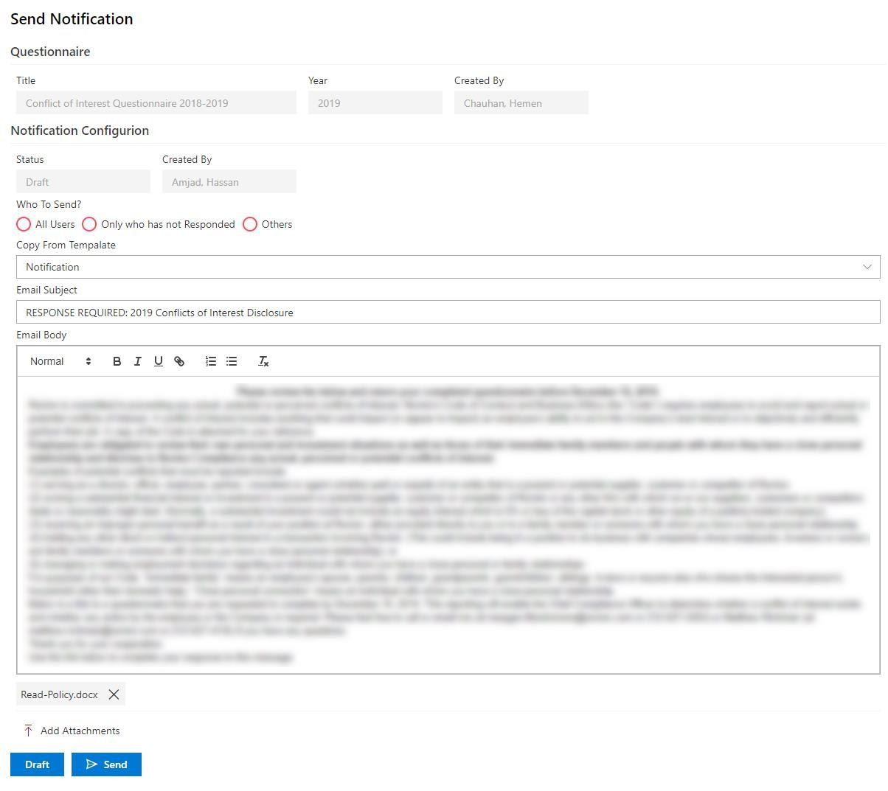

**Hassan Amjad SPFx Showcase Project  
Note**: To jump straight to the code snippets go to [Page 7](#project-code-highlights).

## **Project: CNDS (Compliance Notice Distribution System)**

### Summary

The need for this application arose due to COVID-19. The Compliance department of my client wanted the ability to send out “Return to Workplace” surveys to their various offices around the world and then analyze responses submitted by employees. Originally, they were sending out surveys manually via email to every office but were finding it hard to keep track of all the responses. This application aimed to solve this problem by giving the ability to design surveys and send them out to large distribution lists with just a single click of a button. Once the survey goes out, the application automatically starts capturing the responses from recipients as they come in. The Compliance department can then analyze the captured submissions to decide which offices can be re-opened.

For the sake of brevity, I will focus on the front-end modules of the application.

### Technology Stack

The following technologies were used to develop application front-end.

-   SPFx
-   Node.js
-   JavaScript (ES5, ES6)
-   TypeScript
-   Webpack 4
-   Formik
-   Yup
-   Redux
-   React 16

### Module: Admin Dashboard

This is where all the surveys can be managed by Administrators. Its main feature are as follows:

-   Add or delete people from distribution list.
-   View submission status of each recipient.
-   View notifications that have either been sent or are waiting to be sent.
-   Monitor status of the notifications sent out to distribution lists.

Figure 1- Admin Dashboard - UI

### Module: Survey Builder

The module allowed the application-admins to design and build surveys from scratch. Its main features are as follows:

-   Configure question response types:
    -   Dropdown
    -   Radio
    -   Text
    -   Note
    -   Static
-   Define list of choices to display to the end user for questions whose response type is Radio or Dropdown.

    Note: Order of choices can be changed through drag and drop functionality.

-   Configure follow up questions up to nth level based on answer of parent question.
-   Re-order sibling questions.

Figure 2 - Questionnaire Designer - UI

Figure 3 - Configuring Follow Up Questions - UI

### Module: Send Notification

This module is used to send out customized notifications to the distribution list. Its main features are as follows:

-   Copy email subject and body from pre-defined set of email template.
-   Customize email subject and body.
-   Customize source HTML of email body.
-   Configure email attachments.
-   Option to save the notification as draft or send it immediately.

Figure 4 - Send Notification Form - UI

### Module: Survey

The is the actual survey that gets generated by the ‘Survey Builder’ module and is meant to be filled out and submitted by people in the distribution list. In terms of implementation, the trickiest part of this module was maintaining the ‘display’ property of each question based on the answer of its immediate parent question and also ensuring that the ‘display’ property of the question is ultimately determined by the answer of the top most parent in the hierarchy, not by its immediate parent. All the configuration data for this module is generated by the ‘Survey Builder’ module as stated earlier.

Figure 5 - Questionnaire Form - UI

### Project Code Highlights

#### Batched API Operations

Batched non-dependent API calls to reduce overall processing time.

Figure 6 - Batched API Calls – Code Snippet

Figure 7 - Batched Delete API Operations - Code Snippet

#### ES6 Spread Syntax

Use of ES6 spread syntax to extend or combine map variables.

Figure 8 - ES6 Spread Operator - Code Snippet

#### Handling HTTP Errors Efficiently

Clever use of switch statement for handling HTTP error codes.

Figure 9 - HTTP Error Handling - Code Snippet
